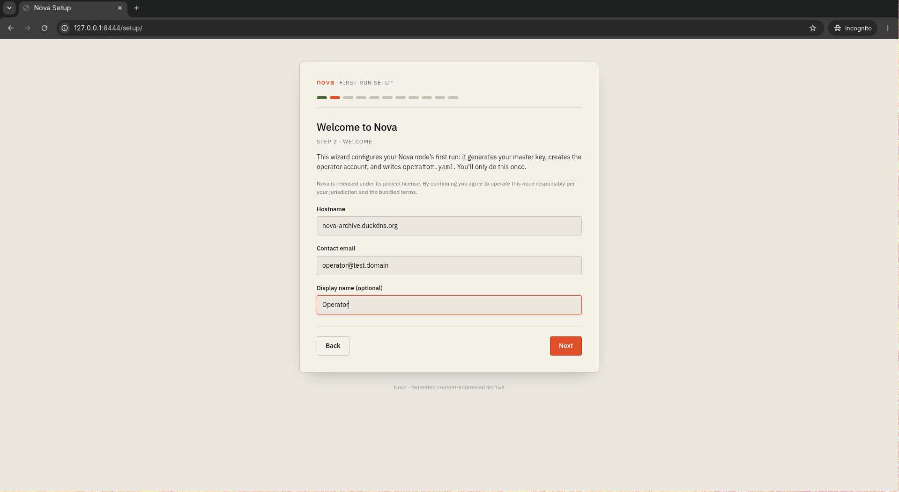
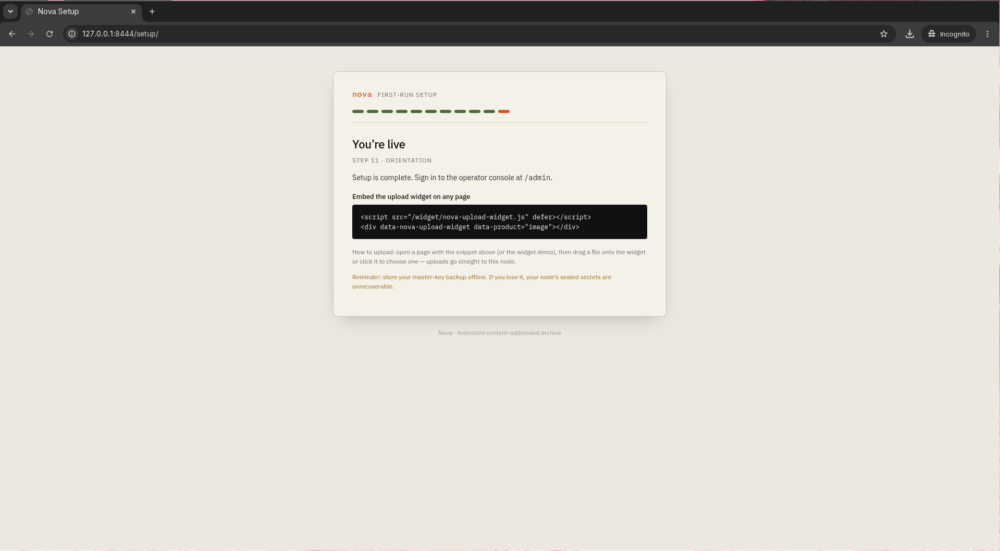

<div align="center">


<h3>Networked Object Versatile Archive</h3>

<p><strong>A self-hostable, federated, content-addressed store for large binary objects</strong> —<br>
for communities that need sovereign, durable, privacy-respecting hosting they control.</p>

<p>


</p>

<p>
<a href="docs/quickstart.md"><b>Operator quickstart</b></a> ·
<a href="docs/quickstart/donor.md"><b>Host a donor node</b></a> ·
<a href="docs/ROADMAP.md"><b>Roadmap</b></a> ·
<a href="docs/development.md"><b>Dev setup</b></a> ·
<a href="docs/THREAT_MODEL.md"><b>Threat model</b></a>
</p>

</div>

---

## What is Nova?

Nova lets you run **your own** durable object store and, optionally, pool storage
across a federation of **donor-operated nodes** — without handing your data, your
keys, or your uptime to a third party.

A site **operator** runs a single coordinator process that speaks a plain HTTP
API and content-addresses every object by the SHA-256 of its ciphertext. Volunteer
**donor nodes** replicate that ciphertext over an authenticated mesh and serve it
on read. Donors never see plaintext or keys — they pin **opaque ciphertext only**.

Nova is an umbrella project. The first product layer, `nova-image`, is
drag-and-drop image hosting with on-the-fly transforms; future layers
(`nova-video`, `nova-audio`, `nova-archive`, `nova-document`) share the same
storage core.

### Why it's different

- **Operator sovereignty.** You run the coordinator on your own infrastructure.
  The project author cannot turn it off, observe it, or coerce it.
- **Donor-blind storage.** Federated nodes pin ciphertext; encryption keys live
  only on the coordinator. A donor can hold your data and learn nothing about it.
- **No third-party traffic by default.** Reads are served from the coordinator;
  donors replicate over an encrypted mesh; no CDN sits in the request path.
  Optional CDN fronting is a documented, deliberate tradeoff — see
  [`docs/recipes/CLOUDFLARE.md`](docs/recipes/CLOUDFLARE.md).
- **Privacy-paranoid by default.** No phone-home, no analytics, no third-party
  assets. A `paranoid: true` switch hardens further for adversarial environments.
- **Framework-agnostic.** Anything that accepts an HTTP URL integrates by pointing
  URLs at Nova. No deep integration required.
- **Permissive licensing.** Apache-2.0 throughout the core, no copyleft deps.

> **Trust-model note.** Nova is donor-blind, *not* operator-blind. The coordinator
> decrypts on read and on transform; the operator's master key is process-resident.
> Nova is the right architecture for "pick an operator you trust, or run your own"
> — it is not end-to-end encrypted *from* the operator. See
> [`docs/THREAT_MODEL.md`](docs/THREAT_MODEL.md).

## Who is it for?

- **Fediverse instances** (Mastodon, Pleroma, Misskey) shifting media storage off
  the homeserver onto a federated donor pool.
- **FOSS forums & community sites** wanting drag-and-drop image hosting without a
  third-party host of unpredictable longevity.
- **ML dataset hosts** distributing reproducible corpora via content-addressed URLs.
- **Preservation archives** keeping high-resolution scans accessible long after
  vendor sites disappear.
- **Release mirrors** distributing artifacts, images, or signed packages with
  content-addressed integrity.
- **Homelabs** running a private federation of friend/family nodes for photos,
  scans, or backups.

## See it

The production first run is a guided setup wizard — no config files to hand-write.

<div align="center">

&nbsp;

</div>

Full walkthrough with every step: [`docs/quickstart.md`](docs/quickstart.md).

## Architecture at a glance

```
   uploader / viewer
         │
         ▼
   nginx (TLS, rate-limit)
         │
         ▼
   Nova Coordinator ── Postgres          keys + plaintext live here only
         │
         ├── embedded IPFS (hardened)
         └── mesh ──► donor storage nodes (×N)   ciphertext-only, donor-blind
```

Every blob is identified by the SHA-256 of its **ciphertext**. Reads are plain
HTTPS URLs and are aggressively cacheable. Donors authenticate to the coordinator
(and to each other, for repair) over an mTLS mesh with `nova://` federation
identities; a node that drops below its reputation floor is automatically excluded
from durability counts and its replicas are re-replicated onto trusted nodes.

Deeper: [`docs/specs/FEDERATION_PROTOCOL.md`](docs/specs/FEDERATION_PROTOCOL.md) ·
[`docs/specs/HEALING_PROTOCOL.md`](docs/specs/HEALING_PROTOCOL.md) ·
[`docs/specs/DATA_MODEL.sql`](docs/specs/DATA_MODEL.sql)

## Getting started

### Run a coordinator (operators)

```sh
cp docker/.env.example docker/.env
# set POSTGRES_PASSWORD in docker/.env, then:
cd docker && docker compose --profile setup up
```

Open the loopback-only wizard at `http://127.0.0.1:8444/setup/` (or run the
headless `novactl setup`). When it writes `.bootstrap-complete`, switch to
`docker compose --profile prod up -d`. The full path — TLS modes, the
secrets-backup obligation, DNS — is in the
[**operator quickstart**](docs/quickstart.md) and
[`docs/legal/OPERATOR_CHECKLIST.md`](docs/legal/OPERATOR_CHECKLIST.md).

### Host a donor node (volunteers)

Donate storage to a federation you trust without ever seeing its data. Start at
the [**donor quickstart**](docs/quickstart/donor.md).

### Hack on Nova (developers)

The lightest dev-test path — a single-node coordinator against a local Postgres +
embedded IPFS — is in [**`docs/development.md`**](docs/development.md).

## Development progress

Phase 0 (specifications) and Phase 1 (single-node MVP) are **complete**; Phase 1
closed at the `v0.1.0-rc1` release candidate (M1–M14 tagged). **Phase 2's donor
federation is volunteer-ready:** the P2-M0.x operator-UX/privacy remediation track
plus P2-M1 through **P2-M7.1** are tagged.

| Track | Status |
|-------|--------|
| **Phase 0** — specifications | ✅ Complete |
| **Phase 1** — single-node MVP (M1–M14) | ✅ Complete (`v0.1.0-rc1`) |
| **Phase 2** — donor federation | 🟢 Shipped through **P2-M7.1** (beta-readiness) |
| ↳ identity, assignment sync, replication, donor-backed reads | ✅ P2-M1 – M4 |
| ↳ liveness + healing, possession audits, production hardening | ✅ P2-M5 – M7 |
| ↳ below-floor replacement, donor↔donor repair TLS, beta hardening | ✅ **P2-M7.1** |
| **Phase 2** — streaming-AEAD envelope | ⏭️ Next (P2-M8+) |

[`docs/ROADMAP.md`](docs/ROADMAP.md) is the authoritative per-milestone status.

## Repository layout

```
docs/          specs (protocol, data model, envelope), runbooks, recipes, legal
internal/      internal Go packages (subject to change)
pkg/           exported, semver-stable Go library packages
cmd/           command-line entry points (coordinator, novactl, migrate, …)
web/widget/    drop-in upload widget (TypeScript)
web/admin/     operator admin SPA (TypeScript)
web/setup/     first-run setup wizard (TypeScript)
docker/        compose + Dockerfiles for the production topology
nginx/         reference reverse-proxy configuration
.github/       CI workflows, security policy, code owners
```

## Contributing

See [`CONTRIBUTING.md`](CONTRIBUTING.md). Project naming hygiene is CI-enforced —
please read the policy section before submitting a PR.

## Security

To report vulnerabilities, see [`SECURITY.md`](.github/SECURITY.md).

## License

Apache License 2.0. See [`LICENSE`](LICENSE).
