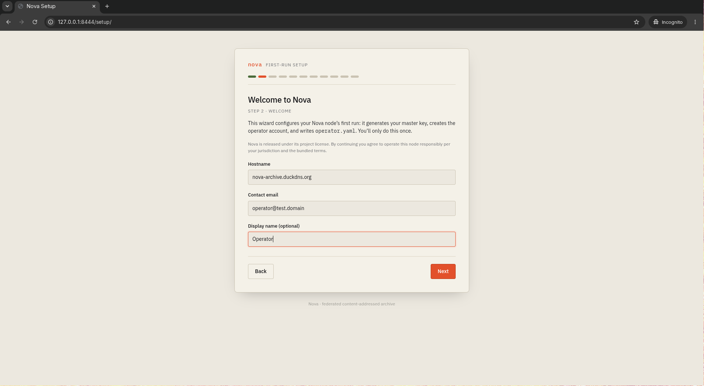
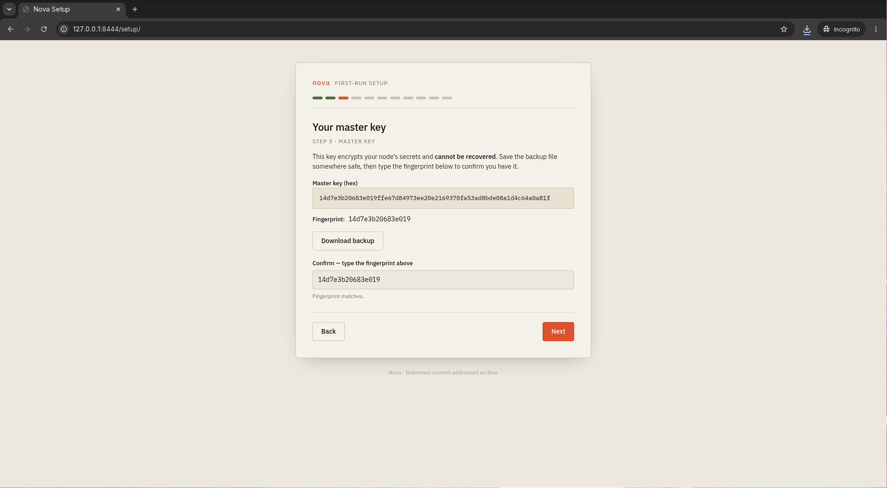
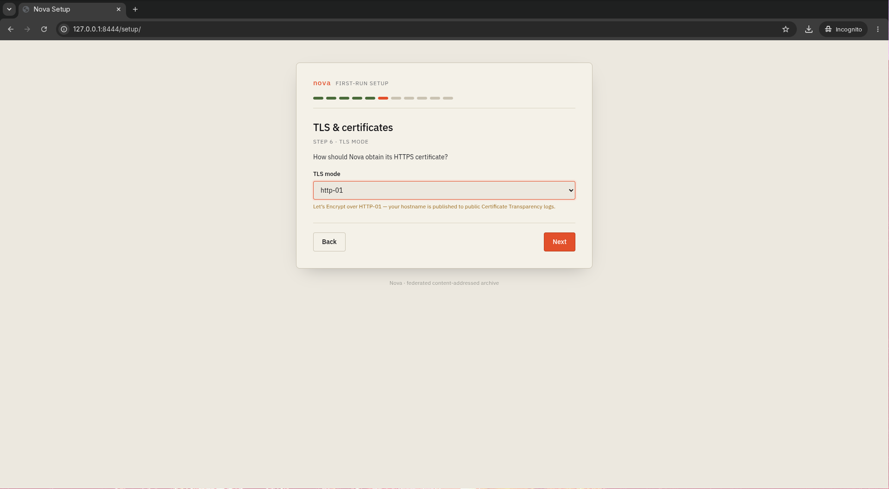
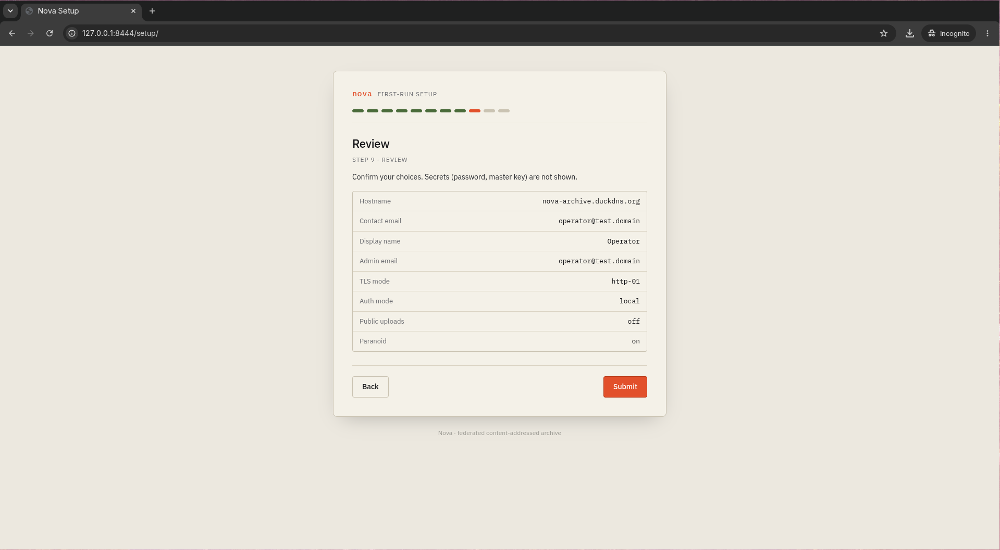
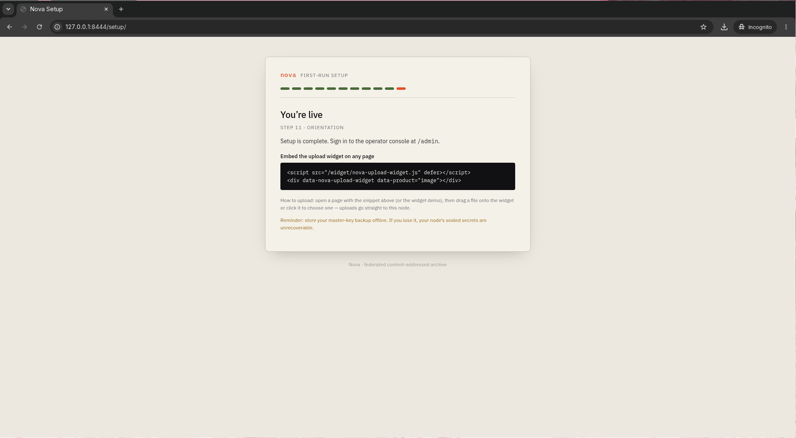

# Nova Operator Quickstart

This walkthrough takes you from a fresh clone to a running Nova node
that serves an uploaded image over HTTPS. At the end you will have:

- the full production stack (coordinator + embedded IPFS, Postgres,
  nginx two-vhost TLS front, certbot) running under Docker Compose;
- a master key you have backed up, an operator account, and a rendered
  `operator.yaml`;
- an image uploaded through the public API and served back at a
  content-addressed URL, with on-the-fly resizing;
- the operator admin console reachable on the loopback admin vhost.

Everything below is copy-pasteable in order. Deep material — backups,
key rotation, moderation, legal posture — is linked at the end, not
duplicated here.

## Prerequisites

- A Linux host with **Docker** and the **compose v2** plugin
  (`docker compose version` works; `docker-compose` v1 is not tested).
- Roughly 5 GB of free disk for the image build (Go + Node multi-stage
  build cache) and volumes, plus whatever you intend to store.
- A public **DNS hostname** pointing at the host — only if you choose
  the `http-01` (Let's Encrypt) TLS mode. Every other mode works
  without one.
- Nothing else. No Go, no Node, no libvips on the host — everything
  ships inside the coordinator image.

## 1. Clone and start setup mode

Clone the repository, seed the compose environment file, and set a real
Postgres password:

```sh
git clone git@github.com:nova-archive/nova.git
cd nova
cp docker/.env.example docker/.env
sed -i "s/changeme/$(openssl rand -hex 16)/" docker/.env
```

Start the **setup profile** — Postgres, the coordinator in first-run
setup mode, and a loopback-only nginx that fronts the wizard:

```sh
docker compose -f docker/docker-compose.yml --env-file docker/.env --profile setup up -d
```

The first run builds the coordinator image; expect a few minutes.

Setup is locked to whoever holds the node's **bootstrap token**, which
the coordinator prints to its log on startup. Retrieve it:

```sh
docker compose -f docker/docker-compose.yml --env-file docker/.env logs coordinator | grep bootstrap_token
```

You will see a line like:

```
nova-coordinator | 2026/06/10 16:04:11 WARN coordinator SETUP MODE: bootstrap token (present as the X-Nova-Setup-Token header in the wizard) — copy it from this log bootstrap_token=aa9e9198cfec47c804350a72a1ba3aba
```

Copy the value after `bootstrap_token=`, then open the wizard at:

```
http://127.0.0.1:8444/setup/
```

The wizard is deliberately bound to loopback. If your node is a remote
server, tunnel the port instead of exposing it:

```sh
ssh -N -L 8444:127.0.0.1:8444 you@your-server
```

## 2. The wizard, step by step

The wizard is a linear stepper; **Next** stays disabled until each
step's requirements are met. You only do this once.

**Bootstrap token.** Paste the token you copied from the coordinator
log. Every wizard request carries it, so nobody who merely reaches the
port can configure your node.

**Welcome.** Enter the node's public hostname (e.g.
`nova.example.org`), a contact email, and an optional display name.
By continuing you agree to operate the node responsibly under the
bundled terms.



**Your master key.** The wizard generates the key that encrypts all of
your node's secrets, shows it once, and offers a backup download.
**This is the one unrecoverable step in the entire setup**: if you
lose the master key, your node's sealed secrets — and with them your
stored content — are gone for good, federation-wide. Click
**Download backup**, store `nova-master-key.txt` somewhere offline,
then type the key's fingerprint into the confirm field. The readback
exists precisely so you cannot click past this step without proving
you captured the key; Next stays disabled until the typed fingerprint
matches. Your IPFS swarm identity and content-signing keys are
generated and sealed automatically alongside the master key — nothing
to enter for those.



**Operator account.** Email and password (12 characters minimum) for
the first operator — this is the account you will use to sign in to
the admin console at `/admin`.

**TLS & certificates.** Pick how Nova obtains its HTTPS certificate.
Each mode shows its privacy cost inline — notably, `http-01` publishes
your hostname to public Certificate Transparency logs. See
[Choosing a TLS mode](#choosing-a-tls-mode) below; `dev-self-signed`
is fine for kicking the tires. `static` additionally asks for your
certificate and key paths. Load-bearing terms (fingerprint, Certificate
Transparency) carry an ⓘ button with a plain-English explanation.



**Public uploads.** Toggle whether anyone may upload through your
node's public widget. If you enable it, a terms-of-service URL is
required (a template lives at
[`legal/TOS_TEMPLATE.md`](legal/TOS_TEMPLATE.md)).

**Privacy & hardening.** A tri-state "Harden privacy (paranoid)"
parent toggle over three individually exposed settings: whether to
record uploader IPs (`record_source_ip`), how long to keep IP logs
(1 day vs. 30), and whether to keep pinned CIDs off the public IPFS
DHT (`public_ipfs_dht`). Each constituent shows its consequence inline;
two additional rows (no outbound webhooks; metrics loopback-only) are
informational. Fully checking all three commits `paranoid: true` in
`operator.yaml`. ⓘ disclosures explain source-IP recording and the
public IPFS DHT in plain language at the point of decision.

**Review.** Confirm your answers (secrets are not shown) and submit.



**Commit.** Committing writes `operator.yaml`, renders the two-vhost
nginx config, creates your operator account, and seals the generated
keys with your master key. This finalizes setup — make sure the
master-key backup is safe before you click **Commit & go live**.

**You're live.** The orientation page shows the admin console link and
the widget embed snippet (both repeated below). The coordinator exits
cleanly behind the scenes and compose restarts it in normal mode.



## 3. Restart into production

Swap the setup profile for the prod profile, which brings up the real
TLS front (wizard-rendered config) and the certbot sidecar:

```sh
docker compose -f docker/docker-compose.yml --env-file docker/.env --profile setup down
docker compose -f docker/docker-compose.yml --env-file docker/.env --profile prod up -d
```

Now live on the host:

| Port | What |
| --- | --- |
| `8443` | Public vhost — HTTPS: blob reads, uploads, transforms, the widget |
| `8442` | Public vhost — HTTP: redirect + ACME challenge (http-01) |
| `127.0.0.1:8445` | Admin vhost — HTTPS: admin console + admin API, loopback only |

Host ports 80/443 are deliberately left free — Nova never grabs
privileged ports or clobbers an existing web server. For a public
deployment, forward `:80 → :8442` and `:443 → :8443` at your firewall
or edge.

Check that everything is up:

```sh
docker compose -f docker/docker-compose.yml --env-file docker/.env --profile prod ps
```

All four services — `postgres`, `coordinator`, `nginx`, `certbot` —
should report `(healthy)` within a minute or so. Then confirm the
public vhost answers (with `dev-self-signed` TLS, `-k` accepts the
self-signed chain and `--resolve` points your wizard hostname at the
box; with a real certificate and DNS you need neither):

```sh
curl -ks --resolve "nova.example.org:8443:127.0.0.1" https://nova.example.org:8443/health
```

## 4. First upload

### Option A — the upload widget

The orientation page already showed you the embed. Drop this on any
page served from your public vhost:

```html
<script src="/widget/nova-upload-widget.js" defer></script>
<div data-nova-upload-widget data-product="image"></div>
```

A ready-made demo page ships at `https://<your-host>:8443/widget/` —
open it and drag an image onto the widget. Anonymous widget uploads
require **public uploads** to be enabled (the wizard toggle); otherwise
mount the widget via JS with a `getToken` provider (see the
[operator checklist](legal/OPERATOR_CHECKLIST.md#upload-widget-m12)).

**Authenticated / off-origin embedding.** To accept authenticated
uploads — or to embed the widget on a *different* origin (e.g. your own
site) without enabling anonymous public uploads — mint a scoped,
revocable upload token and hand it to the widget:

```bash
novactl auth login                       # operator, against the admin vhost
novactl upload-token create --product image --label my-site
# prints a nova_ut_… secret ONCE — store it; serve it to your page from your backend
```

```js
NovaUploadWidget.mount('#uploader', {
  product: 'image',
  getToken: async () => 'nova_ut_…',   // your backend supplies this
});
```

For a cross-origin host page, also set `uploads.cors.enabled: true` with
your site in `allowed_origins`. Full flow, the security note about
embedded tokens, and the `uploads.limits.*` backstops are in the
[operator checklist](legal/OPERATOR_CHECKLIST.md#off-origin-widget-scoped-upload-tokens--cors-m03).

### Option B — curl

One honest caveat first: **in Phase 1, uploads are private by
default.** A blob's visibility comes from the collections it belongs
to, and a blob in no collection resolves to *private* — uploading
works, but anonymous reads of it return 401. Phase 1 has no
collection-management API yet (it is on the
[roadmap](ROADMAP.md)), so to serve a blob publicly you seed a public
collection directly in Postgres, owned by your operator account:

```sh
COL_ID="$(docker compose -f docker/docker-compose.yml --env-file docker/.env exec -T postgres \
  psql -U nova -d nova -tA -c \
  "INSERT INTO collections (owner_id, name, slug, visibility, public_archival)
   SELECT id, 'quickstart-public', 'quickstart-public', 'public', false
   FROM users WHERE email = 'you@example.org'
   RETURNING id;" | head -n1 | tr -d '[:space:]')"
echo "$COL_ID"
```

(Replace `you@example.org` with the admin email you gave the wizard.)

Upload an image into that collection — `product=image` is what makes
the transform routes accept it:

```sh
curl -ks --resolve "nova.example.org:8443:127.0.0.1" \
  -F "file=@photo.png;type=image/png" \
  -F "product=image" \
  -F "collection_id=$COL_ID" \
  https://nova.example.org:8443/api/v1/blobs
```

You get a `201` with a JSON body containing the blob's `cid`. Serve it
back, byte-identical, and resized:

```sh
curl -ks --resolve "nova.example.org:8443:127.0.0.1" -o roundtrip.png \
  https://nova.example.org:8443/blob/<cid>
curl -ks --resolve "nova.example.org:8443:127.0.0.1" -o thumb.png \
  https://nova.example.org:8443/i/<cid>/w320.png
```

Allowed transform widths are `320`, `512`, `1024`, and `2048`; anything
else returns 400. Anonymous curl uploads, like the widget, require
public uploads enabled — otherwise log in first (see below) and pass
`-H "Authorization: Bearer $TOKEN"`.

That's it — you are uploading and serving.

## 5. The admin console

The operator console lives on the **admin vhost**:

```
https://<your-host>:8445/admin
```

Sign in with the admin email and password you gave the wizard. From
there you can browse and delete blobs, inspect audit results, and run
key rotation.

The admin vhost is bound to `127.0.0.1` on the host by default — it is
not reachable from the network, on purpose. To use it remotely, prefer
an SSH tunnel:

```sh
ssh -N -L 8445:127.0.0.1:8445 you@your-server
# then browse https://<your-host>:8445/admin locally
```

If you decide to expose it deliberately (e.g. on a management VLAN),
copy `docker/docker-compose.override.yml.example` to
`docker/docker-compose.override.yml` and add a `ports` entry for the
`nginx` service bound to a **private** interface — never `0.0.0.0`.

The same login works against the admin API directly, e.g. for
scripted bearer tokens:

```sh
curl -ks --resolve "nova.example.org:8445:127.0.0.1" \
  -H 'Content-Type: application/json' \
  -d '{"username":"you@example.org","password":"your-password"}' \
  https://nova.example.org:8445/api/v1/auth/login
```

## Choosing a TLS mode

| Mode | What happens | Privacy note |
| --- | --- | --- |
| `dev-self-signed` | The wizard generates a throwaway CA + leaf. Browsers warn; `curl -k` accepts it. Dev and staging only. | Nothing leaves your machine. |
| `static` | You supply paths to your own fullchain + key PEMs (drop them in the config volume's TLS dir). You own renewal. | No third party is contacted; disclosure depends on where your cert came from. |
| `http-01` | Fully automated Let's Encrypt: the certbot sidecar writes a placeholder so nginx can start, obtains the real certificate on first boot, renews it on a 12-hour check loop, and nginx hot-reloads on every deploy. Zero manual certbot steps. Requires your hostname to resolve publicly and port 80 traffic to reach the stack (forward `:80 → :8442`). | Your hostname is published to public **Certificate Transparency logs** (crt.sh and friends). If that is a deanonymization concern, pick another mode. |
| `dns-01` / `onion` | The wizard renders the config and prints operator-handoff instructions: supply DNS-API credentials out of band (`dns-01`) or run Tor and supply the cert (`onion`). Not automated — see the per-mode guidance in [`legal/OPERATOR_CHECKLIST.md`](legal/OPERATOR_CHECKLIST.md). | `dns-01` certs still land in CT logs but need no inbound port 80; `onion` keeps your service out of public DNS and CT entirely. |

## Headless / scripted setup

Everything the wizard does is also available unattended via
`novactl setup --config-file`, which shares the same validation and
crash-safe commit ordering. Write an answers file:

```yaml
# answers.yaml — Nova first-run answers (see internal/setup/answers.go)
hostname: nova.example.org
contact_email: ops@example.org
display_name: Example Community Archive    # optional
admin_email: you@example.org
admin_password: use-a-long-passphrase      # 12 chars minimum
tls_mode: dev-self-signed                  # dev-self-signed|http-01|dns-01|static|onion
# cert_path: /etc/nova/tls/fullchain.pem   # static mode only
# key_path: /etc/nova/tls/privkey.pem      # static mode only
auth_mode: local                           # local|external
# issuer_url: https://idp.example.org      # external mode only
# client_id: nova-admin                    # external mode only
public_uploads: true
tos_url: https://nova.example.org/tos      # required when public_uploads: true
paranoid: false
```

Then run migrations + setup in a one-off coordinator container (compose
starts Postgres for you; the headless path needs no bootstrap token —
it never opens the network seam). This is an *alternative* first-run
path: run it from a clean slate, **instead of** the setup profile. If
you already started the setup profile, wipe it first with
`docker compose -f docker/docker-compose.yml --env-file docker/.env --profile setup down -v`
(pre-setup there is nothing to lose; the one-off container cannot write
into a secrets volume the setup boot has already claimed):

```sh
docker compose -f docker/docker-compose.yml --env-file docker/.env \
  run --rm -T --entrypoint /bin/sh \
  -v "$PWD/answers.yaml:/answers.yaml:ro" \
  coordinator -c "/usr/local/bin/migrate up && /usr/local/bin/novactl setup --config-file /answers.yaml"
```

Follow with the same prod-profile commands from
[step 3](#3-restart-into-production). The headless path is also how
you configure an **external OIDC** provider (`auth_mode: external`),
which the web wizard does not offer.

The same answers file drives CI: [`scripts/smoke.sh`](../scripts/smoke.sh)
is a living end-to-end example of exactly this flow — headless setup,
prod profile, upload, read-back, transform, delete.

## Next steps

- **Read the operator checklist** —
  [`legal/OPERATOR_CHECKLIST.md`](legal/OPERATOR_CHECKLIST.md) is the
  deep runbook. Non-negotiables first:
  - **Back up the secrets volume.** The wizard generated your master
    key, swarm key, and signing key into the `nova-secrets` volume;
    back it up out-of-band *before you accept traffic*. The paper
    backup the wizard made you download is the floor, not the ceiling.
  - **Master-key rotation** — the five-step runbook when you need to
    rotate.
  - **Moderation and DMCA** — ToS, designated-agent registration, and
    takedown procedure if you host public uploads.
  - **Re-arming the wizard** — deleting `.bootstrap-complete` from the
    config volume puts the node back in setup mode; that is the
    documented redo path, and a thing to be careful of.
- **Inspect and tune settings at runtime** — once the node is up you do
  not need to edit `operator.yaml` by hand. Use `novactl config`:

  ```sh
  novactl auth login                            # operator, against the admin vhost
  novactl config get --effects                  # print effective config + per-field source/effect
  novactl config set uploads.limits.max_concurrent_global 8   # live — no restart needed
  novactl config set auth.issuer_url https://idp.example/     # restart-required — flagged in response
  ```

  Fields marked `live` take effect immediately in process. Fields marked
  `restart` are persisted and validated now but need a coordinator restart to
  apply — the response lists them in `restart_required`. See
  [`legal/OPERATOR_CHECKLIST.md`](legal/OPERATOR_CHECKLIST.md#runtime-configuration-m04)
  for the full API reference, effect-class table, env-override behaviour,
  and optimistic-concurrency (`If-Match`) details.

- **See where the project is going** — [`ROADMAP.md`](ROADMAP.md)
  covers the rest of Phase 1 and the Phase 2 federation work
  (collection APIs, donor storage nodes, streaming envelope).
